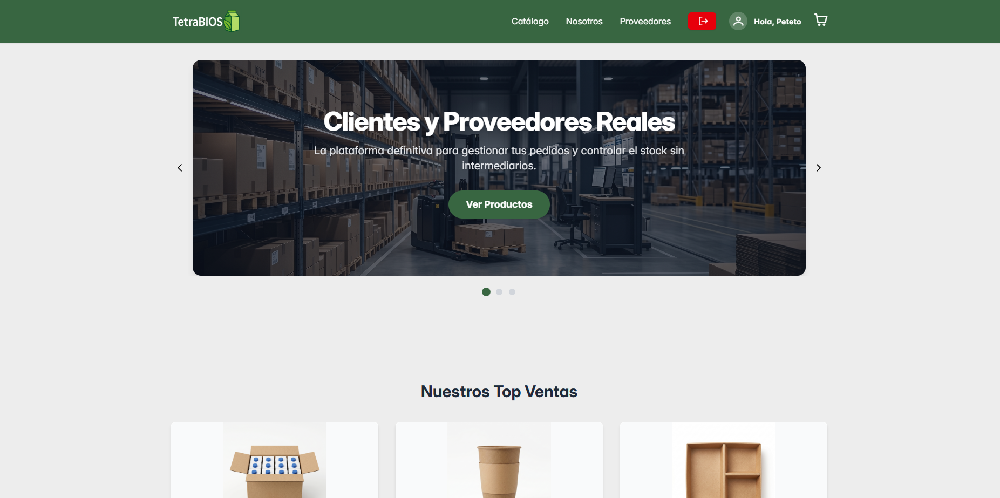
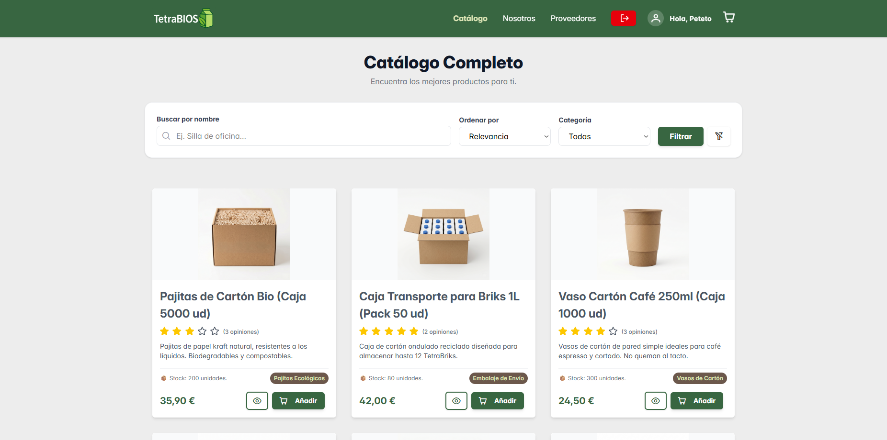
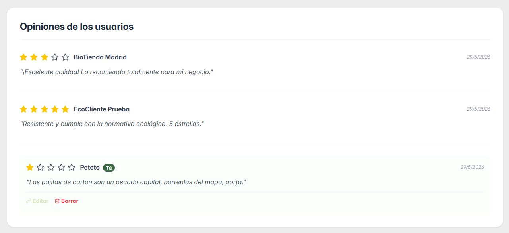
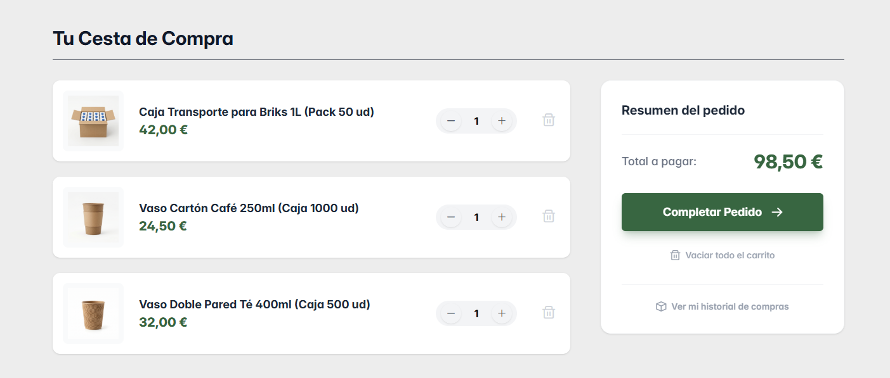
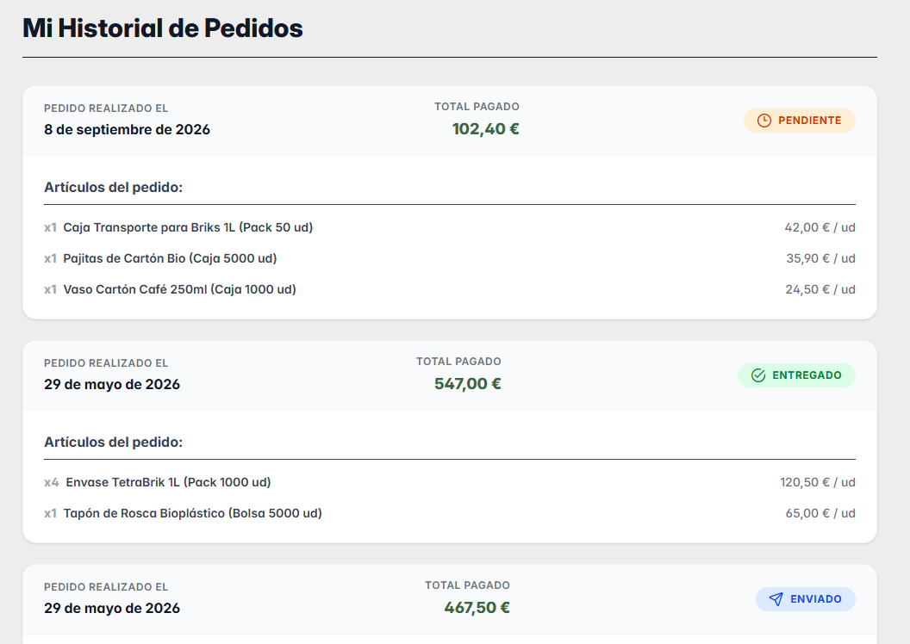
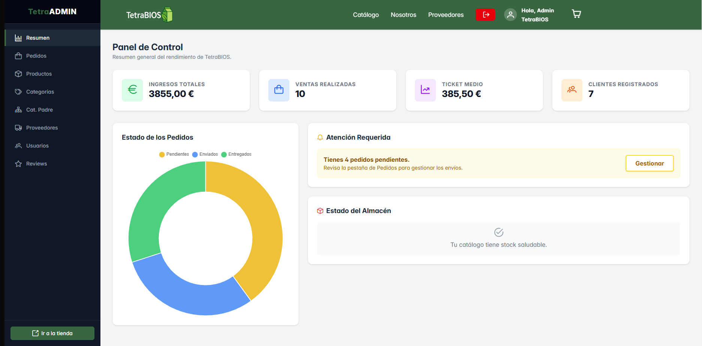

# 🌱 TetraBIOS — Frontend

### Sustainable B2B e-commerce platform built with React

TetraBIOS is a **B2B e-commerce web application** designed for companies, educational centres and catering services looking for sustainable alternatives to single-use plastics.

This repository contains the **frontend application**, developed as a **Single Page Application (SPA)** using React. It communicates with a Laravel REST API responsible for authentication, business logic and data persistence.

The complete project was developed as my **Final Degree Project (DAW)**.

---

## 🚀 Live Demo

🌐 **Production:**
https://tetrabios-pablo-v.vercel.app/

🔗 **Backend API:**
https://tfg-backend-pablov-production.up.railway.app/

🔗 **Backend repository:**
https://github.com/PabloVidalOrtega/TFG-BackEnd-PabloV

---

## 📸 Application Preview

### Home



### Product catalogue



### Product details & reviews



### Shopping cart



### Order history



### Administration panel



---

## ✨ Features

### 🛍️ Customer experience

* Responsive product catalogue.
* Product filtering and navigation by categories.
* Product detail pages.
* Shopping cart management.
* Customer registration and login.
* Order creation.
* Order history.
* Product reviews and ratings.
* Responsive design for desktop, tablet and mobile devices.

### 🧑‍💼 Administration

The application includes a dedicated administration area for managing the platform.

Administrators can manage:

* Products and inventory.
* Product prices and stock.
* Suppliers.
* Categories and parent categories.
* Registered users.
* Reviews.

The administration interface makes use of **PrimeReact** components for tables, dialogs, forms and notifications.

### 🔐 Authentication & protected routes

The frontend communicates with the backend using token-based authentication.

After authentication, the application uses the token provided by Laravel Sanctum when making requests to protected API endpoints.

The frontend also checks the user's authentication state and role before allowing access to protected views such as the administration panel.

---

## 🏗️ Architecture

TetraBIOS follows a **client-server architecture** based on a RESTful API.

```text
┌─────────────────────────┐
│       React SPA         │
│                         │
│ React + Vite            │
│ Tailwind CSS            │
│ React Router            │
│ Context API             │
│ Custom Hooks            │
│ PrimeReact              │
└────────────┬────────────┘
             │
             │ HTTP / JSON
             │
             ▼
┌─────────────────────────┐
│      Laravel API        │
│                         │
│ RESTful endpoints       │
│ Authentication          │
│ Authorization           │
│ Business logic          │
└────────────┬────────────┘
             │
             ▼
┌─────────────────────────┐
│       PostgreSQL        │
└─────────────────────────┘
```

The frontend is responsible for the **presentation and interaction layer**, while the backend centralizes the application's business logic and data management.

This separation also makes the API reusable for other possible clients in the future.

---

## 🧩 Frontend Architecture

The application was developed as a **Single Page Application**.

### React

The interface is built using reusable React components.

Examples include:

* Navigation components.
* Product cards.
* Product detail views.
* Shopping cart components.
* Administration components.
* Forms and reusable UI elements.

This approach keeps the interface modular and allows components to be reused throughout the application.

### React Router

React Router DOM is used to provide navigation between the main application views without full page reloads.

```text
/
├── /catalogo
├── /producto/:id
├── /carrito
├── /pedidos
├── /login
├── /registro
└── /admin
```

Protected views are checked according to the current authentication state and user role.

### Context API

The application uses React Context to manage information that needs to be available across different parts of the application.

Examples include:

* Authentication state.
* User information.
* User role.
* Product data.

This avoids unnecessary prop drilling between components.

### Custom Hooks

Reusable logic has been extracted into custom hooks, including hooks responsible for:

* Authentication.
* API communication.
* Accessing application contexts.

This keeps visual components cleaner and makes common logic easier to maintain.

---

## 🎨 UI & Responsive Design

The interface was designed with a **mobile-first responsive approach** using Tailwind CSS.

The visual identity follows the TetraBIOS brand:

| Element      | Value     |
| ------------ | --------- |
| Primary      | `#386641` |
| Secondary    | `#6C584C` |
| Tertiary     | `#DDE5B6` |
| Neutral      | `#EDEDED` |
| Main Font    | Inter     |
| Heading Font | Outfit    |

The frontend uses Tailwind utilities for layout, spacing, typography, responsive breakpoints and interactive states.

The catalogue adapts its layout depending on the screen size, allowing the application to work across desktop, tablet and mobile devices.

---

## 🔌 API Communication

The frontend communicates with the Laravel backend through a **RESTful API**.

Requests are handled using the native JavaScript **Fetch API**, with JSON used for data exchange.

Authenticated requests include the token provided by Laravel Sanctum.

```text
User
 │
 ▼
React Component
 │
 ▼
Custom Hook
 │
 ▼
Fetch API
 │
 ▼
Laravel REST API
 │
 ▼
JSON Response
 │
 ▼
React UI
```

Keeping API communication separated inside reusable logic makes it easier to maintain and modify the communication layer in the future.

---

## 🧑‍💻 Administration Interface

The administration section was built using React together with **PrimeReact**.

Among the main components used are:

* `DataTable` — data tables with pagination, filtering and sorting.
* `Dialog` — modal forms and confirmation dialogs.
* `Toast` — temporary feedback messages.
* Form components such as `InputText`, `InputNumber`, `Dropdown` and `Button`.

This allowed complex administration interfaces to be implemented without recreating every UI component from scratch.

---

## 🔐 Frontend Security

The frontend includes protected routes for authenticated areas of the application.

For example, access to `/admin` is checked before rendering the administration panel.

However, authorization is **not delegated exclusively to the frontend**.

The Laravel API independently validates authentication, roles and permissions before executing protected operations.

This means that hiding a frontend route does not grant access to the underlying backend operation.

---

## ☁️ Deployment

The frontend is deployed on **Vercel** and communicates with the Laravel API deployed on **Railway**.

```text
                    GitHub
                      │
             ┌────────┴────────┐
             ▼                 ▼
          Vercel            Railway
             │                 │
             ▼                 ▼
        React SPA         Laravel API
                               │
                               ▼
                          PostgreSQL
```

Environment variables are used to configure the backend API URL instead of hardcoding environment-specific URLs into the application.

A Vercel rewrite configuration is also included to correctly handle direct navigation to SPA routes such as `/admin`.

---

## ⚙️ Getting Started

### Prerequisites

Make sure you have installed:

* Node.js
* npm
* Git

### Installation

Clone the repository:

```bash
git clone https://github.com/PabloVidalOrtega/TFG-FrontEnd-PabloV.git
```

Enter the project directory:

```bash
cd TFG-FrontEnd-PabloV
```

Install dependencies:

```bash
npm install
```

Create the required environment file:

```text
.env
```

Configure the backend API URL according to your environment.

Start the development server:

```bash
npm run dev
```

The application will then be available through the local development URL provided by Vite.

---

## 📂 Project Structure

A simplified view of the frontend architecture:

```text
src/
├── components/
├── pages/
├── hooks/
├── context/
├── services/
├── assets/
└── ...
```

The application separates reusable visual components, pages, state management and API-related logic to keep the codebase maintainable.

---

## 🔗 Related Repository

### Backend — Laravel REST API

The backend contains:

* RESTful API endpoints.
* Authentication with Laravel Sanctum.
* Roles and permissions.
* Business logic.
* Request validation.
* PostgreSQL integration.
* Product, order, supplier and review management.

👉 https://github.com/PabloVidalOrtega/TFG-BackEnd-PabloV

---

## 🎓 About the Project

TetraBIOS was developed individually as my **Final Degree Project for the Higher Technical Degree in Web Application Development (DAW)**.

The project covers the complete development lifecycle:

```text
Analysis
   ↓
Database Design
   ↓
Backend API
   ↓
Frontend SPA
   ↓
Authentication & Authorization
   ↓
Testing
   ↓
Cloud Deployment
```

The main objective was to build a complete B2B e-commerce platform while applying modern web development practices and separating the frontend presentation layer from the backend business logic.

---

## 👨‍💻 Author

**Pablo Vidal Ortega**

Junior Web Developer

* GitHub: https://github.com/PabloVidalOrtega
* Email: [vidalpablo783@gmail.com](mailto:vidalpablo783@gmail.com)
